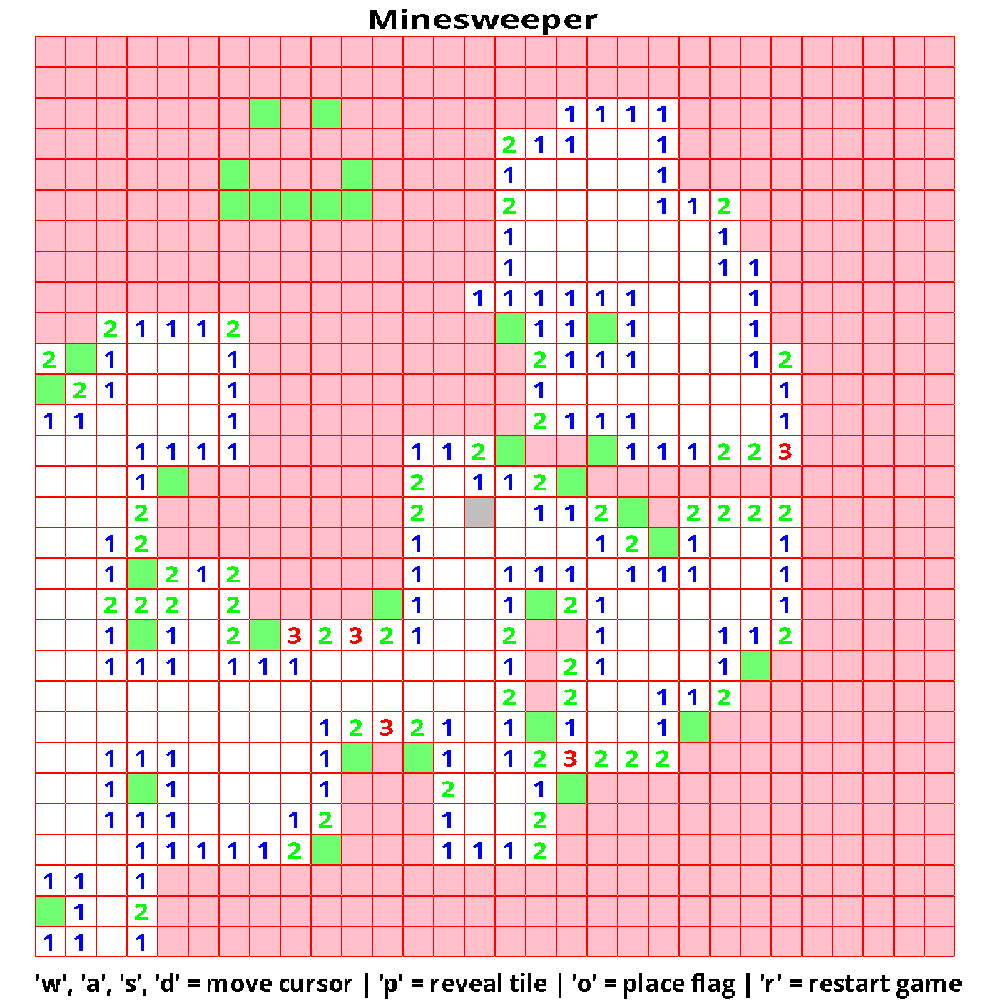

# Minesweeper in C


## Dependencies:
* SDL2
* SDL2_ttf

## Compilation:
* change directory into build/
```cmake
$ cmake ../
$ make
```
## Execution:
* change directory into build/
```bash
$ ./minesweeper 
```

